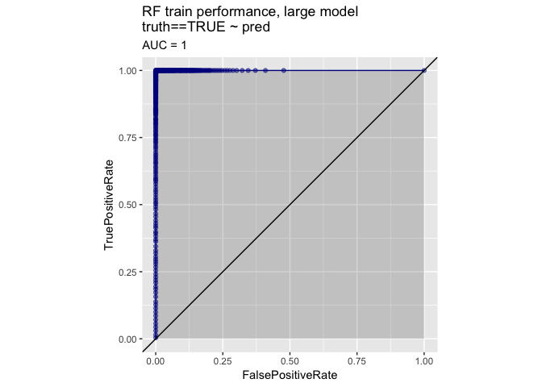
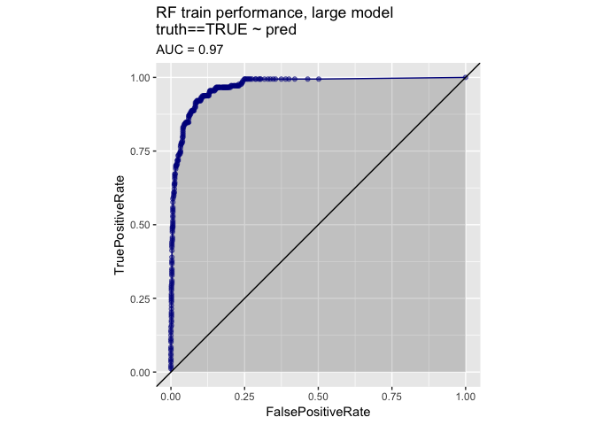
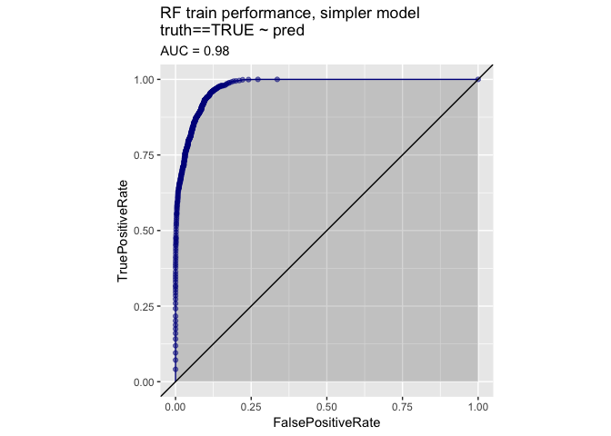
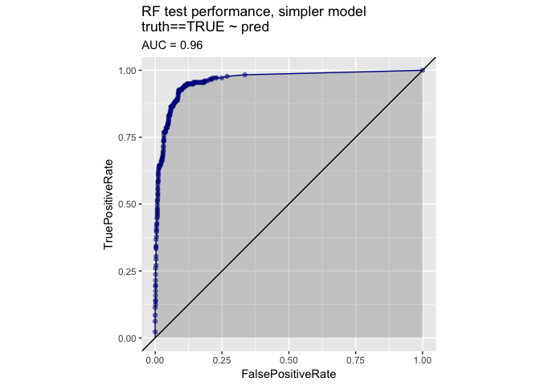

Buzz model
================

Markdown version of Buzz data analysis
======================================

by: Nina Zumel and John Mount Win-Vector LLC

To run this example you need a system with R installed (see <http://cran.r-project.org>), and data from <https://github.com/WinVector/PDSwR2/tree/master/Buzz>.

We are not performing any new analysis here, just supplying a direct application of Random Forests on the data.

Data from: <http://ama.liglab.fr/datasets/buzz/> Using: [TomsHardware-Relative-Sigma-500.data](http://ama.liglab.fr/datasets/buzz/classification/TomsHardware/Relative_labeling/sigma=500/TomsHardware-Relative-Sigma-500.data)

(described in [TomsHardware-Relative-Sigma-500.names](http://ama.liglab.fr/datasets/buzz/classification/TomsHardware/Relative_labeling/sigma=500/TomsHardware-Relative-Sigma-500.names) )

Crypto hashes: shasum TomsHardware-*.txt * 5a1cc7863a9da8d6e8380e1446f25eec2032bd91 TomsHardware-Absolute-Sigma-500.data.txt \* 86f2c0f4fba4fb42fe4ee45b48078ab51dba227e TomsHardware-Absolute-Sigma-500.names.txt \* c239182c786baf678b55f559b3d0223da91e869c TomsHardware-Relative-Sigma-500.data.txt \* ec890723f91ae1dc87371e32943517bcfcd9e16a TomsHardware-Relative-Sigma-500.names.txt

To run this example you need a system with R installed (see [cran](http://cran.r-project.org)), Latex (see [tug](http://tug.org)) and data from [PDSwR2](https://github.com/WinVector/PDSwR2/tree/master/Buzz).

To run this example: \* Download buzzm.Rmd and TomsHardware-Relative-Sigma-500.data.txt from the github URL. \* Start a copy of R, use setwd() to move to the directory you have stored the files. \* Make sure knitr is loaded into R ( install.packages('knitr') and library(knitr) ). \* In R run: (produces [buzzm.md](https://github.com/WinVector/PDSwR2/blob/master/Buzz/buzzm.md) from buzzm.Rmd).

``` r
knit('buzzm.Rmd')
```

Now you can run the following data prep steps:

``` r
infile <- "TomsHardware-Relative-Sigma-500.data.txt"
paste('checked at', date())
```

    ## [1] "checked at Wed Apr 17 16:37:16 2019"

``` r
system(paste('shasum', infile), intern=T)  # write down file hash
```

    ## [1] "c239182c786baf678b55f559b3d0223da91e869c  TomsHardware-Relative-Sigma-500.data.txt"

``` r
buzzdata <- read.table(infile, header = FALSE, sep = ",")

makevars <- function(colname, ndays = 7) {
  sprintf("%s_%02g", colname, 0:ndays)
}

varnames <- c(
  "num.new.disc",
  "burstiness",
  "number.total.disc",
  "auth.increase",
  "atomic.containers", # not documented
  "num.displays", # number of times topic displayed to user (measure of interest)
  "contribution.sparseness", # not documented
  "avg.auths.per.disc",
  "num.authors.topic", # total authors on the topic
  "avg.disc.length",
  "attention.level.author",
  "attention.level.contrib"
)

colnames <- unlist(lapply(varnames, FUN=makevars))
colnames <-  c(colnames, "buzz")
colnames(buzzdata) <- colnames

# Split into training and test
set.seed(2362690L)
rgroup <- runif(dim(buzzdata)[1])
buzztrain <- buzzdata[rgroup > 0.1,]
buzztest <- buzzdata[rgroup <=0.1,]
```

This currently returns a training set with 7114 rows and a test set with 791 rows, which is the same as when this document was prepared.

Notice we have exploded the basic column names into the following:

``` r
print(colnames)
```

    ##  [1] "num.new.disc_00"            "num.new.disc_01"           
    ##  [3] "num.new.disc_02"            "num.new.disc_03"           
    ##  [5] "num.new.disc_04"            "num.new.disc_05"           
    ##  [7] "num.new.disc_06"            "num.new.disc_07"           
    ##  [9] "burstiness_00"              "burstiness_01"             
    ## [11] "burstiness_02"              "burstiness_03"             
    ## [13] "burstiness_04"              "burstiness_05"             
    ## [15] "burstiness_06"              "burstiness_07"             
    ## [17] "number.total.disc_00"       "number.total.disc_01"      
    ## [19] "number.total.disc_02"       "number.total.disc_03"      
    ## [21] "number.total.disc_04"       "number.total.disc_05"      
    ## [23] "number.total.disc_06"       "number.total.disc_07"      
    ## [25] "auth.increase_00"           "auth.increase_01"          
    ## [27] "auth.increase_02"           "auth.increase_03"          
    ## [29] "auth.increase_04"           "auth.increase_05"          
    ## [31] "auth.increase_06"           "auth.increase_07"          
    ## [33] "atomic.containers_00"       "atomic.containers_01"      
    ## [35] "atomic.containers_02"       "atomic.containers_03"      
    ## [37] "atomic.containers_04"       "atomic.containers_05"      
    ## [39] "atomic.containers_06"       "atomic.containers_07"      
    ## [41] "num.displays_00"            "num.displays_01"           
    ## [43] "num.displays_02"            "num.displays_03"           
    ## [45] "num.displays_04"            "num.displays_05"           
    ## [47] "num.displays_06"            "num.displays_07"           
    ## [49] "contribution.sparseness_00" "contribution.sparseness_01"
    ## [51] "contribution.sparseness_02" "contribution.sparseness_03"
    ## [53] "contribution.sparseness_04" "contribution.sparseness_05"
    ## [55] "contribution.sparseness_06" "contribution.sparseness_07"
    ## [57] "avg.auths.per.disc_00"      "avg.auths.per.disc_01"     
    ## [59] "avg.auths.per.disc_02"      "avg.auths.per.disc_03"     
    ## [61] "avg.auths.per.disc_04"      "avg.auths.per.disc_05"     
    ## [63] "avg.auths.per.disc_06"      "avg.auths.per.disc_07"     
    ## [65] "num.authors.topic_00"       "num.authors.topic_01"      
    ## [67] "num.authors.topic_02"       "num.authors.topic_03"      
    ## [69] "num.authors.topic_04"       "num.authors.topic_05"      
    ## [71] "num.authors.topic_06"       "num.authors.topic_07"      
    ## [73] "avg.disc.length_00"         "avg.disc.length_01"        
    ## [75] "avg.disc.length_02"         "avg.disc.length_03"        
    ## [77] "avg.disc.length_04"         "avg.disc.length_05"        
    ## [79] "avg.disc.length_06"         "avg.disc.length_07"        
    ## [81] "attention.level.author_00"  "attention.level.author_01" 
    ## [83] "attention.level.author_02"  "attention.level.author_03" 
    ## [85] "attention.level.author_04"  "attention.level.author_05" 
    ## [87] "attention.level.author_06"  "attention.level.author_07" 
    ## [89] "attention.level.contrib_00" "attention.level.contrib_01"
    ## [91] "attention.level.contrib_02" "attention.level.contrib_03"
    ## [93] "attention.level.contrib_04" "attention.level.contrib_05"
    ## [95] "attention.level.contrib_06" "attention.level.contrib_07"
    ## [97] "buzz"

We are now ready to create a simple model predicting "buzz" as function of the other columns.

``` r
# build a model
# let's use all the input variables
nlist = varnames
varslist = as.vector(sapply(nlist, FUN=makevars))

# these were defined previously in Practical Data Science with R
loglikelihood <- function(y, py) {
  pysmooth <- ifelse(py == 0, 1e-12,
                     ifelse(py == 1, 1-1e-12, py))
  sum(y * log(pysmooth) + (1 - y) * log(1 - pysmooth))
}

accuracyMeasures <- function(pred, truth, threshold=0.5, name="model") {
  dev.norm <- -2 * loglikelihood(as.numeric(truth), pred) / length(pred)
  ctable = table(truth = truth,
                 pred = pred > threshold)
  accuracy <- sum(diag(ctable)) / sum(ctable)
  precision <- ctable[2, 2] / sum(ctable[, 2])
  recall <- ctable[2, 2] / sum(ctable[2, ])
  f1 <- 2 * precision * recall / (precision + recall)
  print(paste("precision=", precision, "; recall=" , recall))
  print(ctable)
  data.frame(model = name, 
             accuracy = accuracy, 
             f1 = f1, 
             dev.norm = dev.norm,
             AUC = sigr::calcAUC(pred, truth))
}


library("randomForest")
```

    ## randomForest 4.6-14

    ## Type rfNews() to see new features/changes/bug fixes.

``` r
bzFormula <- paste('as.factor(buzz) ~ ', paste(varslist, collapse = ' + '))
fmodel <- randomForest(as.formula(bzFormula),
                      data = buzztrain,
                      importance = TRUE)

print('training')
```

    ## [1] "training"

``` r
rtrain <- data.frame(truth = buzztrain$buzz, 
                     pred = predict(fmodel, newdata = buzztrain, type="prob")[, 2, drop = TRUE])
print(accuracyMeasures(rtrain$pred, rtrain$truth))
```

    ## [1] "precision= 1 ; recall= 0.999360613810742"
    ##      pred
    ## truth FALSE TRUE
    ##     0  5550    0
    ##     1     1 1563
    ##   model  accuracy        f1  dev.norm AUC
    ## 1 model 0.9998594 0.9996802 0.1049166   1

``` r
WVPlots::ROCPlot(rtrain, "pred", "truth", TRUE, "RF train performance, large model")
```



``` r
print('test')
```

    ## [1] "test"

``` r
rtest <- data.frame(truth = buzztest$buzz, 
                    pred = predict(fmodel, newdata=buzztest, type="prob")[, 2, drop = TRUE])
print(accuracyMeasures(rtest$pred, rtest$truth))
```

    ## [1] "precision= 0.832402234636871 ; recall= 0.84180790960452"
    ##      pred
    ## truth FALSE TRUE
    ##     0   584   30
    ##     1    28  149
    ##   model  accuracy        f1 dev.norm       AUC
    ## 1 model 0.9266751 0.8370787  0.42056 0.9702102

``` r
WVPlots::ROCPlot(rtest, "pred", "truth", TRUE, "RF train performance, large model")
```



Notice the extreme fall-off from training to test performance, the random forest over fit on training. We see good accuracy on test (around 92%), but not the perfect fit seen on training.

To try and control the over-fitting we build a new model with the tree complexity limited to 50 nodes and the node size to at least 100. This is not necessarily a better model (in fact it scores slightly poorer on test), but it is one where the training procedure didn't have enough freedom to memorize the training data (and therefore maybe had better visibility into some trade-offs.

``` r
fmodel <- randomForest(as.formula(bzFormula),
                      data = buzztrain,
                      maxnodes = 50,
                      nodesize = 100,
                      importance = TRUE)

print('training')
```

    ## [1] "training"

``` r
rtrain <- data.frame(truth = buzztrain$buzz, 
                     pred = predict(fmodel, newdata=buzztrain, type="prob")[, 2, drop = TRUE])
print(accuracyMeasures(rtrain$pred, rtrain$truth))
```

    ## [1] "precision= 0.809937888198758 ; recall= 0.833759590792839"
    ##      pred
    ## truth FALSE TRUE
    ##     0  5244  306
    ##     1   260 1304
    ##   model  accuracy        f1  dev.norm       AUC
    ## 1 model 0.9204386 0.8216761 0.3412138 0.9763961

``` r
print('test')
```

    ## [1] "test"

``` r
rtest <- data.frame(truth = buzztest$buzz, 
                    pred = predict(fmodel, newdata=buzztest, type="prob")[, 2, drop = TRUE])
print(accuracyMeasures(rtest$pred, rtest$truth))
```

    ## [1] "precision= 0.816666666666667 ; recall= 0.830508474576271"
    ##      pred
    ## truth FALSE TRUE
    ##     0   581   33
    ##     1    30  147
    ##   model accuracy        f1  dev.norm       AUC
    ## 1 model 0.920354 0.8235294 0.5751291 0.9624625

And we can also make plots.

Training performance:

``` r
WVPlots::ROCPlot(rtrain, "pred", "truth", TRUE, "RF train performance, simpler model")
```



Test performance:

``` r
WVPlots::ROCPlot(rtest, "pred", "truth", TRUE, "RF test performance, simpler model")
```



Notice this has similar test performance as the first model. This is typical of random forests: the degree of over-fit in the training data is not a good predictor of good or bad performance on test data.

So we are now left with a choice, unfortunately without clear guidance: which model do we use? In this case we are going to say: use the simpler model fit on all the data. The idea is the simpler model didn't test much worse and more data lets helps the model reduce over-fitting.

``` r
# train on all the data
fmodel <- randomForest(as.formula(bzFormula),
                      data = buzzdata,
                      maxnodes = 50,
                      nodesize = 100,
                      importance = T)
```

Save prepared R environment.

``` r
fname <- 'thRS500.Rdata'
items <- c("colnames", "fmodel")
if(!file.exists(fname)) {
   save(list = items, file = fname)
   message(paste('saved', fname))  # message to running R console
   print(paste('saved', fname))    # print to document
} else {
   message(paste('skipped saving', fname)) # message to running R console
   print(paste('skipped saving', fname))   # print to document
}
```

    ## [1] "skipped saving thRS500.Rdata"

``` r
paste('checked at', date())
```

    ## [1] "checked at Wed Apr 17 16:40:38 2019"

``` r
system(paste('shasum', fname), intern = TRUE)  # write down file hash
```

    ## [1] "353b2f1e8600e38e4352b3950400338434af06ab  thRS500.Rdata"
