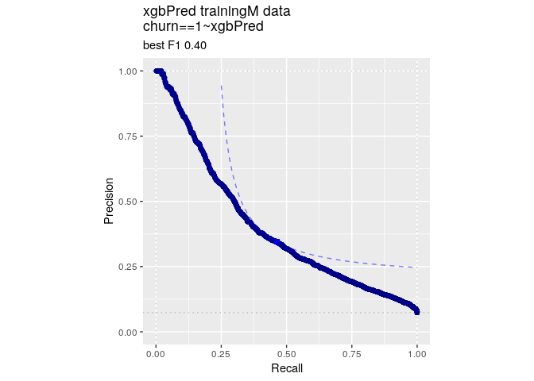
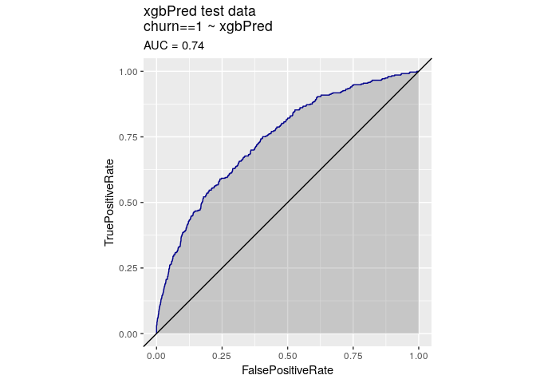
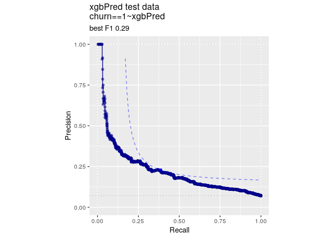

KDD2009vtreat
================
John Mount

Practical data science with R built chapter 6 built a number of single variable models. In Listing 6.11 it used an ad-hoc entropy based out of sample effect size estimate for variable selection. This likely (though it isn't completely rigorous) picked variables conservatively.

``` r
date()
```

    ## [1] "Wed Feb 27 12:18:41 2019"

``` r
#load some libraries
library('vtreat')
library('WVPlots') 
library('sigr')
library('parallel')
library('xgboost')
```

    ## Warning: package 'xgboost' was built under R version 3.5.2

``` r
dir = "./"


# generated/code/CodeExamples/c08_Advanced_Data_Preparation/00327_example_8.1_of_section_8.2.1.R 
# example 8.1 of section 8.2.1 
# (example 8.1 of section 8.2.1)  : Advanced Data Preparation : KDD and KDD Cup 2009 : Getting started with KDD Cup 2009 data 
# Title: Preparing the KDD data for analysis 

d <- read.table('orange_small_train.data.gz',   # Note: 1 
   header = TRUE,
   sep = '\t',
   na.strings = c('NA', ''))    # Note: 2 
                                                
churn <- read.table('orange_small_train_churn.labels.txt',
   header = FALSE, sep = '\t')  # Note: 3 
d$churn <- churn$V1     # Note: 4 

set.seed(729375)    # Note: 5 
rgroup <- base::sample(c('train', 'calibrate', 'test'),     # Note: 6 
   nrow(d), 
   prob = c(0.8, 0.1, 0.1),
   replace = TRUE)
dTrain <- d[rgroup=='train', , drop = FALSE]
dCal <- d[rgroup=='calibrate', , drop = FALSE]
dTrainAll <- d[rgroup %in% c('train', 'calibrate'), , drop = FALSE]
dTest <- d[rgroup == 'test', , drop = FALSE]
                                                
outcome <- 'churn' 
vars <- setdiff(colnames(dTrainAll), outcome)

                                                
rm(list=c('d', 'churn', 'rgroup'))  # Note: 9

# Note 1: 
#   Read the file of independent variables. All 
#   data from 
#   https://github.com/WinVector/PDSwR2/tree/master/KDD2009. 

# Note 2: 
#   Treat both NA and the empty string as missing 
#   data. 

# Note 3: 
#   Read churn dependent variable. 

# Note 4: 
#   Add churn as a new column. 

# Note 5: 
#   By setting the seed to the pseudo-random 
#   number generator, we make our work reproducible: 
#   someone redoing it will see the exact same 
#   results. 

# Note 6: 
#   Split data into train, calibration, and test sets. 
#   We took extra care and wrote base::sample() even if 
#   the popular dplyr package is attached, which also  
#   has a function with this name. 

# Note 9: 
#   Remove unneeded objects from workspace. 

# Note 10: 
#   Further split training data into training and 
#   calibration. 

set.seed(239525)

ncore <- parallel::detectCores()
(cl = parallel::makeCluster(ncore))
```

    ## socket cluster with 4 nodes on host 'localhost'

``` r
yName <- "churn"
yTarget <- 1

date()
```

    ## [1] "Wed Feb 27 12:18:51 2019"

``` r
date()
```

    ## [1] "Wed Feb 27 12:18:51 2019"

``` r
var_values <- vtreat::value_variables_C(dTrain,
    vars,yName,yTarget,
    smFactor=2.0, 
    parallelCluster=cl
    )


summary(var_values$sig < 1/nrow(var_values))
```

    ##    Mode   FALSE    TRUE 
    ## logical      63     149

``` r
length(vars)
```

    ## [1] 230

``` r
vars <- var_values$var[var_values$sig < 1/nrow(var_values)]
length(vars)
```

    ## [1] 149

``` r
date()
```

    ## [1] "Wed Feb 27 12:24:51 2019"

``` r
date()
```

    ## [1] "Wed Feb 27 12:24:51 2019"

``` r
# Run other models (with proper coding/training separation).
#
# This gets us back to AUC 0.74 range

customCoders = list('c.PiecewiseV.num' = vtreat::solve_piecewise,
                    'n.PiecewiseV.num' = vtreat::solve_piecewise,
                    'c.knearest.num' = vtreat::square_window,
                    'n.knearest.num' = vtreat::square_window)
cfe = mkCrossFrameCExperiment(dTrain,
                              vars,yName,yTarget,
                              customCoders=customCoders,
                              smFactor=2.0, 
                              parallelCluster=cl)
```

    ## [1] "vtreat 1.3.8 start initial treatment design Wed Feb 27 12:24:51 2019"
    ## [1] " start cross frame work Wed Feb 27 12:28:42 2019"
    ## [1] " vtreat::mkCrossFrameCExperiment done Wed Feb 27 12:31:17 2019"

``` r
treatmentsC = cfe$treatments
scoreFrame = treatmentsC$scoreFrame
table(scoreFrame$code)
```

    ## 
    ##       catB       catP      clean      isBAD   knearest        lev 
    ##         28         28        119        117          2        118 
    ## PiecewiseV 
    ##        115

``` r
selvars <- scoreFrame$varName
treatedTrainM <- cfe$crossFrame[,c(yName,selvars),drop=FALSE]
treatedTrainM[[yName]] = treatedTrainM[[yName]]==yTarget

treatedTest = prepare(treatmentsC,
                      dTest,
                      pruneSig=NULL, 
                      varRestriction = selvars,
                      parallelCluster=cl)
treatedTest[[yName]] = treatedTest[[yName]]==yTarget

# prepare plotting frames
treatedTrainP = treatedTrainM[, yName, drop=FALSE]
treatedTestP = treatedTest[, yName, drop=FALSE]
date()
```

    ## [1] "Wed Feb 27 12:31:18 2019"

``` r
date()
```

    ## [1] "Wed Feb 27 12:31:18 2019"

``` r
mname = 'xgbPred'
print(paste(mname,length(selvars)))
```

    ## [1] "xgbPred 527"

``` r
params <- list(max_depth = 5, 
              objective = "binary:logistic",
              nthread = ncore)
model <- xgb.cv(data = as.matrix(treatedTrainM[, selvars, drop = FALSE]),
                label = treatedTrainM[[yName]],
                nrounds = 400,
                params = params,
                nfold = 5,
                early_stopping_rounds = 10,
                eval_metric = "logloss")
```

    ## [1]  train-logloss:0.502522+0.000766 test-logloss:0.504077+0.001190 
    ## Multiple eval metrics are present. Will use test_logloss for early stopping.
    ## Will train until test_logloss hasn't improved in 10 rounds.
    ## 
    ## [2]  train-logloss:0.399080+0.001161 test-logloss:0.401988+0.002190 
    ## [3]  train-logloss:0.336624+0.001236 test-logloss:0.341163+0.003198 
    ## [4]  train-logloss:0.297330+0.001479 test-logloss:0.303238+0.003922 
    ## [5]  train-logloss:0.272011+0.001335 test-logloss:0.279072+0.004448 
    ## [6]  train-logloss:0.255199+0.001396 test-logloss:0.263665+0.005005 
    ## [7]  train-logloss:0.243878+0.001551 test-logloss:0.253598+0.005539 
    ## [8]  train-logloss:0.236231+0.001590 test-logloss:0.247443+0.005974 
    ## [9]  train-logloss:0.230489+0.001665 test-logloss:0.243474+0.006171 
    ## [10] train-logloss:0.226246+0.001614 test-logloss:0.240913+0.006314 
    ## [11] train-logloss:0.222835+0.001700 test-logloss:0.239313+0.006173 
    ## [12] train-logloss:0.219935+0.001750 test-logloss:0.238178+0.006317 
    ## [13] train-logloss:0.217437+0.001676 test-logloss:0.237387+0.006283 
    ## [14] train-logloss:0.215570+0.001689 test-logloss:0.236941+0.006252 
    ## [15] train-logloss:0.213353+0.001618 test-logloss:0.236557+0.006540 
    ## [16] train-logloss:0.211551+0.001683 test-logloss:0.236353+0.006514 
    ## [17] train-logloss:0.209835+0.001873 test-logloss:0.236320+0.006439 
    ## [18] train-logloss:0.208149+0.001716 test-logloss:0.236361+0.006477 
    ## [19] train-logloss:0.206326+0.001740 test-logloss:0.236299+0.006409 
    ## [20] train-logloss:0.204415+0.001643 test-logloss:0.236300+0.006579 
    ## [21] train-logloss:0.202811+0.001633 test-logloss:0.236526+0.006594 
    ## [22] train-logloss:0.201339+0.001567 test-logloss:0.236680+0.006618 
    ## [23] train-logloss:0.200166+0.001363 test-logloss:0.236750+0.006538 
    ## [24] train-logloss:0.198764+0.001323 test-logloss:0.236970+0.006611 
    ## [25] train-logloss:0.197737+0.001180 test-logloss:0.237093+0.006660 
    ## [26] train-logloss:0.196483+0.001547 test-logloss:0.237159+0.006791 
    ## [27] train-logloss:0.195283+0.001398 test-logloss:0.237290+0.006588 
    ## [28] train-logloss:0.193827+0.001499 test-logloss:0.237471+0.006690 
    ## [29] train-logloss:0.192644+0.001224 test-logloss:0.237701+0.006644 
    ## Stopping. Best iteration:
    ## [19] train-logloss:0.206326+0.001740 test-logloss:0.236299+0.006409

``` r
nrounds <- model$best_iteration
print(paste("nrounds", nrounds))
```

    ## [1] "nrounds 19"

``` r
model <- xgboost(data = as.matrix(treatedTrainM[, selvars, drop = FALSE]),
                 label = treatedTrainM[[yName]],
                 nrounds = nrounds,
                 params = params)
```

    ## [1]  train-error:0.071780 
    ## [2]  train-error:0.071805 
    ## [3]  train-error:0.071730 
    ## [4]  train-error:0.071980 
    ## [5]  train-error:0.072055 
    ## [6]  train-error:0.072404 
    ## [7]  train-error:0.072204 
    ## [8]  train-error:0.072055 
    ## [9]  train-error:0.072030 
    ## [10] train-error:0.071805 
    ## [11] train-error:0.071455 
    ## [12] train-error:0.071106 
    ## [13] train-error:0.070706 
    ## [14] train-error:0.070157 
    ## [15] train-error:0.070132 
    ## [16] train-error:0.069683 
    ## [17] train-error:0.069608 
    ## [18] train-error:0.069433 
    ## [19] train-error:0.069258

``` r
treatedTrainP[[mname]] = predict(model, 
                                 newdata=as.matrix(treatedTrainM[, selvars, drop = FALSE]), 
                                 type='response')
treatedTestP[[mname]] = predict(model,
                                newdata=as.matrix(treatedTest[, selvars, drop = FALSE]), 
                                n.trees=nTrees)
date()
```

    ## [1] "Wed Feb 27 12:34:41 2019"

``` r
calcAUC(treatedTestP[[mname]], treatedTestP[[yName]]==yTarget)
```

    ## [1] 0.7266667

``` r
wrapChiSqTest(treatedTestP, mname, yName, yTarget = yTarget)
```

    ## [1] "Chi-Square Test summary: pseudo-R2=0.09368 (X2(1,N=4975)=249.7, p<1e-05)."

``` r
date()
```

    ## [1] "Wed Feb 27 12:34:41 2019"

``` r
t1 = paste(mname,'trainingM data')
print(DoubleDensityPlot(treatedTrainP, mname, yName, 
                        title=t1))
```


``` r
print(ROCPlot(treatedTrainP, mname, yName, yTarget,
              title=t1))
```


``` r
print(WVPlots::PRPlot(treatedTrainP, mname, yName, yTarget,
              title=t1))
```



``` r
t2 = paste(mname,'test data')
print(DoubleDensityPlot(treatedTestP, mname, yName, 
                        title=t2))
```


``` r
print(ROCPlot(treatedTestP, mname, yName, yTarget,
              title=t2))
```



``` r
print(WVPlots::PRPlot(treatedTestP, mname, yName, yTarget,
              title=t2))
```



``` r
print(date())
```

    ## [1] "Wed Feb 27 12:34:45 2019"

``` r
print("*****************************")
```

    ## [1] "*****************************"

``` r
date()
```

    ## [1] "Wed Feb 27 12:34:45 2019"

``` r
if(!is.null(cl)) {
    parallel::stopCluster(cl)
    cl = NULL
}
```
