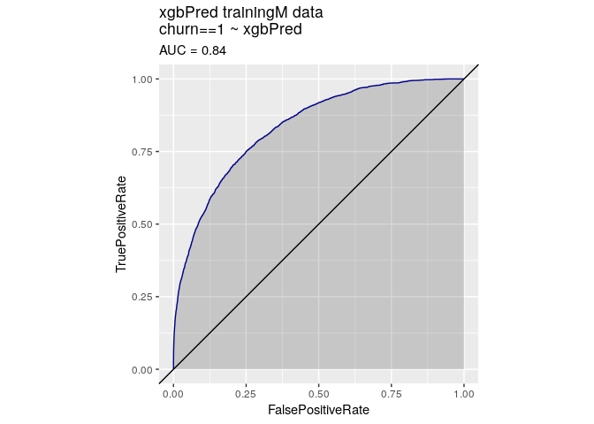
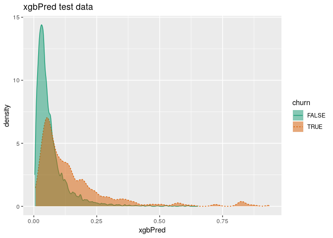

KDD2009vtreat
================
John Mount

Practical data science with R built chapter 6 built a number of single variable models. In Listing 6.11 it used an ad-hoc entropy based out of sample effect size estimate for variable selection. This likely (though it isn't completely rigorous) picked variables conservatively.

``` r
date()
```

    ## [1] "Wed Feb 27 11:32:02 2019"

``` r
#load some libraries
library('vtreat')
library('WVPlots') 

library('parallel')
library('xgboost')
```

    ## Warning: package 'xgboost' was built under R version 3.5.2

``` r
dir = "./"


# generated/code/CodeExamples/c08_Advanced_Data_Preparation/00327_example_8.1_of_section_8.2.1.R 
# example 8.1 of section 8.2.1 
# (example 8.1 of section 8.2.1)  : Advanced Data Preparation : KDD and KDD Cup 2009 : Getting started with KDD Cup 2009 data 
# Title: Preparing the KDD data for analysis 

d <- read.table('orange_small_train.data.gz',   # Note: 1 
   header = TRUE,
   sep = '\t',
   na.strings = c('NA', ''))    # Note: 2 
                                                
churn <- read.table('orange_small_train_churn.labels.txt',
   header = FALSE, sep = '\t')  # Note: 3 
d$churn <- churn$V1     # Note: 4 

set.seed(729375)    # Note: 5 
rgroup <- base::sample(c('train', 'calibrate', 'test'),     # Note: 6 
   nrow(d), 
   prob = c(0.8, 0.1, 0.1),
   replace = TRUE)
dTrain <- d[rgroup=='train', , drop = FALSE]
dCal <- d[rgroup=='calibrate', , drop = FALSE]
dTrainAll <- d[rgroup %in% c('train', 'calibrate'), , drop = FALSE]
dTest <- d[rgroup == 'test', , drop = FALSE]
                                                
outcome <- 'churn' 
vars <- setdiff(colnames(dTrainAll), outcome)

                                                
rm(list=c('d', 'churn', 'rgroup'))  # Note: 9

# Note 1: 
#   Read the file of independent variables. All 
#   data from 
#   https://github.com/WinVector/PDSwR2/tree/master/KDD2009. 

# Note 2: 
#   Treat both NA and the empty string as missing 
#   data. 

# Note 3: 
#   Read churn dependent variable. 

# Note 4: 
#   Add churn as a new column. 

# Note 5: 
#   By setting the seed to the pseudo-random 
#   number generator, we make our work reproducible: 
#   someone redoing it will see the exact same 
#   results. 

# Note 6: 
#   Split data into train, calibration, and test sets. 
#   We took extra care and wrote base::sample() even if 
#   the popular dplyr package is attached, which also  
#   has a function with this name. 

# Note 9: 
#   Remove unneeded objects from workspace. 

# Note 10: 
#   Further split training data into training and 
#   calibration. 

set.seed(239525)

ncore <- parallel::detectCores()
(cl = parallel::makeCluster(ncore))
```

    ## socket cluster with 4 nodes on host 'localhost'

``` r
yName <- "churn"
yTarget <- 1

date()
```

    ## [1] "Wed Feb 27 11:32:09 2019"

``` r
date()
```

    ## [1] "Wed Feb 27 11:32:09 2019"

``` r
var_values <- vtreat::value_variables_C(dTrain,
    vars,yName,yTarget,
    smFactor=2.0, 
    parallelCluster=cl
    )


summary(var_values$sig < 1/nrow(var_values))
```

    ##    Mode   FALSE    TRUE 
    ## logical      63     149

``` r
length(vars)
```

    ## [1] 230

``` r
vars <- var_values$var[var_values$sig < 1/nrow(var_values)]
length(vars)
```

    ## [1] 149

``` r
date()
```

    ## [1] "Wed Feb 27 11:37:29 2019"

``` r
date()
```

    ## [1] "Wed Feb 27 11:37:30 2019"

``` r
# Run other models (with proper coding/training separation).
#
# This gets us back to AUC 0.74 range

customCoders = list('c.PiecewiseV.num' = vtreat::solve_piecewise,
                    'n.PiecewiseV.num' = vtreat::solve_piecewise,
                    'c.knearest.num' = vtreat::square_window,
                    'n.knearest.num' = vtreat::square_window)
cfe = mkCrossFrameCExperiment(dTrain,
                              vars,yName,yTarget,
                              customCoders=customCoders,
                              smFactor=2.0, 
                              parallelCluster=cl)
```

    ## [1] "vtreat 1.3.8 start initial treatment design Wed Feb 27 11:37:30 2019"
    ## [1] " start cross frame work Wed Feb 27 11:41:17 2019"
    ## [1] " vtreat::mkCrossFrameCExperiment done Wed Feb 27 11:43:53 2019"

``` r
treatmentsC = cfe$treatments
scoreFrame = treatmentsC$scoreFrame
table(scoreFrame$code)
```

    ## 
    ##       catB       catP      clean      isBAD   knearest        lev 
    ##         28         28        119        117          2        118 
    ## PiecewiseV 
    ##        115

``` r
selvars <- scoreFrame$varName
treatedTrainM <- cfe$crossFrame[,c(yName,selvars),drop=FALSE]
treatedTrainM[[yName]] = treatedTrainM[[yName]]==yTarget

treatedTest = prepare(treatmentsC,
                      dTest,
                      pruneSig=NULL, 
                      varRestriction = selvars,
                      parallelCluster=cl)
treatedTest[[yName]] = treatedTest[[yName]]==yTarget

# prepare plotting frames
treatedTrainP = treatedTrainM[, yName, drop=FALSE]
treatedTestP = treatedTest[, yName, drop=FALSE]
date()
```

    ## [1] "Wed Feb 27 11:43:54 2019"

``` r
date()
```

    ## [1] "Wed Feb 27 11:43:54 2019"

``` r
mname = 'xgbPred'
print(paste(mname,length(selvars)))
```

    ## [1] "xgbPred 527"

``` r
params <- list(max_depth = 5, 
              objective = "binary:logistic",
              nthread = ncore)
model <- xgb.cv(data = as.matrix(treatedTrainM[, selvars, drop = FALSE]),
                label = treatedTrainM[[yName]],
                nrounds = 400,
                params = params,
                nfold = 5,
                early_stopping_rounds = 10,
                eval_metric = "logloss")
```

    ## [1]  train-logloss:0.502198+0.000619 test-logloss:0.503715+0.001170 
    ## Multiple eval metrics are present. Will use test_logloss for early stopping.
    ## Will train until test_logloss hasn't improved in 10 rounds.
    ## 
    ## [2]  train-logloss:0.398854+0.001037 test-logloss:0.401651+0.002194 
    ## [3]  train-logloss:0.336383+0.001203 test-logloss:0.340642+0.003088 
    ## [4]  train-logloss:0.297145+0.001413 test-logloss:0.302776+0.003659 
    ## [5]  train-logloss:0.271698+0.001449 test-logloss:0.278600+0.004301 
    ## [6]  train-logloss:0.254849+0.001563 test-logloss:0.263440+0.004862 
    ## [7]  train-logloss:0.243444+0.001444 test-logloss:0.253556+0.005174 
    ## [8]  train-logloss:0.235783+0.001486 test-logloss:0.247213+0.005495 
    ## [9]  train-logloss:0.230123+0.001462 test-logloss:0.243200+0.005741 
    ## [10] train-logloss:0.225846+0.001530 test-logloss:0.240565+0.005823 
    ## [11] train-logloss:0.222383+0.001600 test-logloss:0.239025+0.005917 
    ## [12] train-logloss:0.219691+0.001663 test-logloss:0.237912+0.005836 
    ## [13] train-logloss:0.217529+0.001531 test-logloss:0.237259+0.005922 
    ## [14] train-logloss:0.215212+0.001381 test-logloss:0.236892+0.005962 
    ## [15] train-logloss:0.213126+0.001410 test-logloss:0.236678+0.005882 
    ## [16] train-logloss:0.211278+0.001349 test-logloss:0.236414+0.006213 
    ## [17] train-logloss:0.209448+0.001459 test-logloss:0.236357+0.006442 
    ## [18] train-logloss:0.207694+0.001297 test-logloss:0.236332+0.006443 
    ## [19] train-logloss:0.205883+0.001369 test-logloss:0.236516+0.006547 
    ## [20] train-logloss:0.204228+0.001601 test-logloss:0.236611+0.006539 
    ## [21] train-logloss:0.202707+0.001793 test-logloss:0.236523+0.006511 
    ## [22] train-logloss:0.201271+0.002017 test-logloss:0.236767+0.006470 
    ## [23] train-logloss:0.200108+0.002065 test-logloss:0.237011+0.006455 
    ## [24] train-logloss:0.198799+0.002189 test-logloss:0.236980+0.006412 
    ## [25] train-logloss:0.197431+0.002213 test-logloss:0.237156+0.006131 
    ## [26] train-logloss:0.195781+0.002405 test-logloss:0.237340+0.006162 
    ## [27] train-logloss:0.194850+0.002178 test-logloss:0.237325+0.006252 
    ## [28] train-logloss:0.193586+0.002363 test-logloss:0.237243+0.006358 
    ## Stopping. Best iteration:
    ## [18] train-logloss:0.207694+0.001297 test-logloss:0.236332+0.006443

``` r
nrounds <- model$best_iteration
print(paste("nrounds", nrounds))
```

    ## [1] "nrounds 18"

``` r
model <- xgboost(data = as.matrix(treatedTrainM[, selvars, drop = FALSE]),
                 label = treatedTrainM[[yName]],
                 nrounds = nrounds,
                 params = params)
```

    ## [1]  train-error:0.071455 
    ## [2]  train-error:0.071330 
    ## [3]  train-error:0.071405 
    ## [4]  train-error:0.071805 
    ## [5]  train-error:0.071181 
    ## [6]  train-error:0.071281 
    ## [7]  train-error:0.071181 
    ## [8]  train-error:0.071555 
    ## [9]  train-error:0.071355 
    ## [10] train-error:0.071355 
    ## [11] train-error:0.070931 
    ## [12] train-error:0.070831 
    ## [13] train-error:0.070806 
    ## [14] train-error:0.070232 
    ## [15] train-error:0.070182 
    ## [16] train-error:0.069808 
    ## [17] train-error:0.069308 
    ## [18] train-error:0.069258

``` r
treatedTrainP[[mname]] = predict(model, 
                                 newdata=as.matrix(treatedTrainM[, selvars, drop = FALSE]), 
                                 type='response')
treatedTestP[[mname]] = predict(model,
                                newdata=as.matrix(treatedTest[, selvars, drop = FALSE]), 
                                n.trees=nTrees)
date()
```

    ## [1] "Wed Feb 27 11:47:04 2019"

``` r
date()
```

    ## [1] "Wed Feb 27 11:47:04 2019"

``` r
t1 = paste(mname,'trainingM data')
print(DoubleDensityPlot(treatedTrainP, mname, yName, 
                        title=t1))
```


``` r
print(ROCPlot(treatedTrainP, mname, yName, yTarget,
              title=t1))
```



``` r
print(WVPlots::PRPlot(treatedTrainP, mname, yName, yTarget,
              title=t1))
```


``` r
t2 = paste(mname,'test data')
print(DoubleDensityPlot(treatedTestP, mname, yName, 
                        title=t2))
```



``` r
print(ROCPlot(treatedTestP, mname, yName, yTarget,
              title=t2))
```


``` r
print(WVPlots::PRPlot(treatedTestP, mname, yName, yTarget,
              title=t2))
```


``` r
print(date())
```

    ## [1] "Wed Feb 27 11:47:08 2019"

``` r
print("*****************************")
```

    ## [1] "*****************************"

``` r
date()
```

    ## [1] "Wed Feb 27 11:47:08 2019"

``` r
if(!is.null(cl)) {
    parallel::stopCluster(cl)
    cl = NULL
}
```
